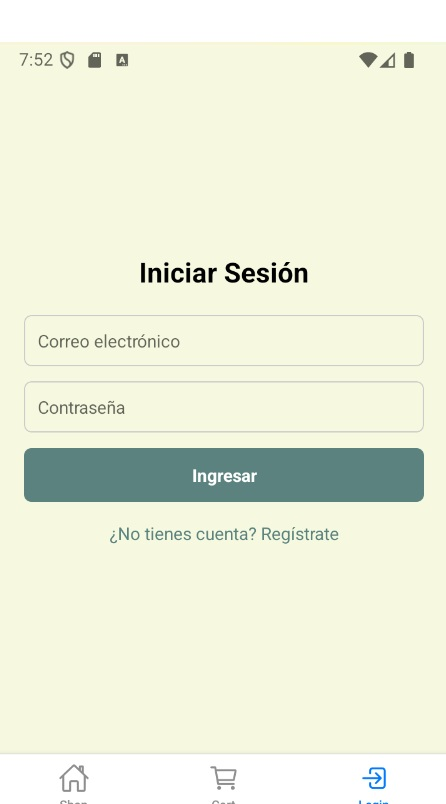
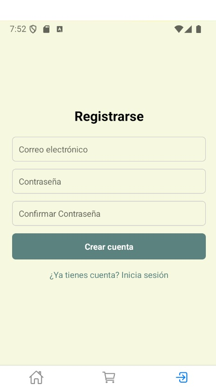
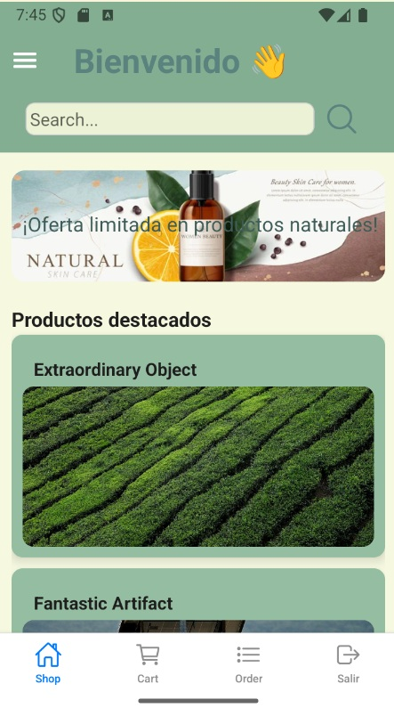
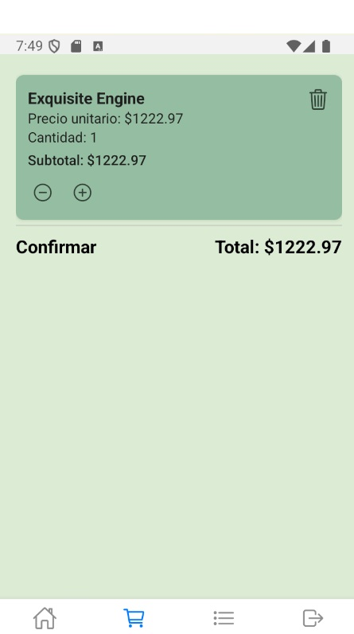
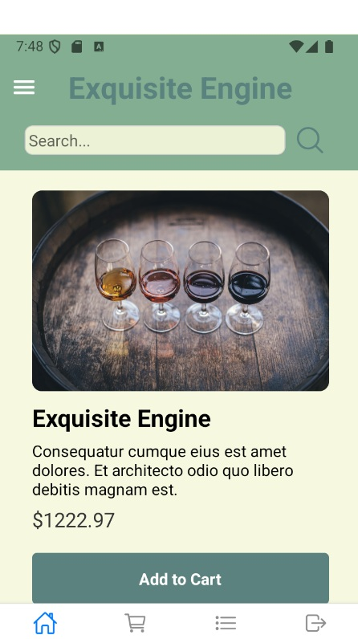
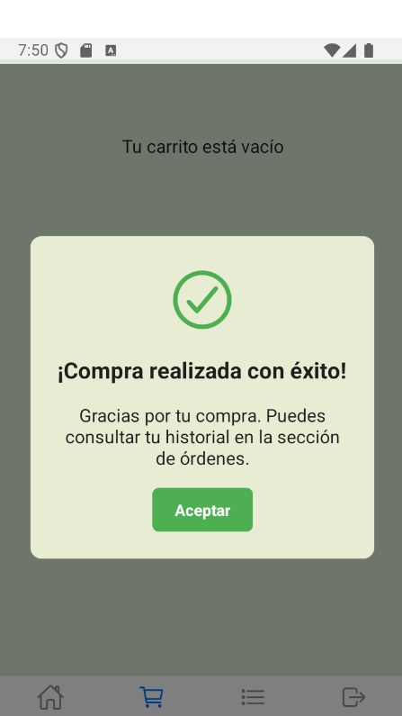
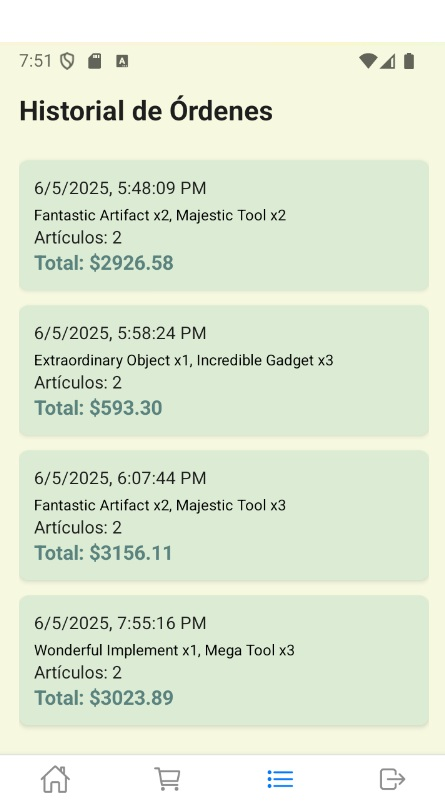

# 🛒 E-Commerce App - React Native

Una aplicación móvil de comercio electrónico desarrollada como proyecto final del curso de React Native con persistencia offline, autenticación y uso de interfaces del dispositivo.

## 🚀 Descripción

Esta app permite a los usuarios:

- Navegar productos organizados por categorías.
- Agregar artículos al carrito.
- Confirmar pedidos.
- Registrarse e iniciar sesión con autenticación Firebase.
- Mantener su sesión activa gracias a la persistencia local (SQLite).
- Ver productos sugeridos en base a su ubicación geográfica (usando Location).
- Disfrutar de sincronización con Firebase Realtime Database para mantener el inventario y los pedidos actualizados.

## 🧱 Tecnologías utilizadas

- **React Native** (Expo)
- **Redux Toolkit** para manejo de estado global
- **Firebase**:
  - Authentication
  - Realtime Database
- **SQLite (expo-sqlite)** para persistencia local y sesiones offline
- **React Navigation** para estructura de navegación con Stack, Tabs y Drawer
- **Location API** para obtener la ciudad del usuario y personalizar el banner con productos locales sugeridos

## 📁 Estructura del proyecto

```bash
├── assets/                 # Imágenes, fuentes y otros recursos estáticos
├── components/             # Componentes reutilizables (Inputs, Cards, etc.)
├── navigation/             # Lógica de navegación con Stack/Tab/Drawer
├── redux/                  # Slices y store de Redux Toolkit
├── screens/                # Pantallas principales (Home, Login, Register, Cart, etc.)
├── services/               # Funciones Firebase, SQLite y APIs del sistema
├── theme/                  # Paleta de colores y estilos globales
├── App.js                  # Entry point de la app
├── README.md               # Documentación del proyecto
```

## 🔐 Funcionalidades clave

- 🧾 **Autenticación**: Registro e inicio de sesión con email/contraseña.
- 🛍️ **Gestión de pedidos**: Carrito, resumen de compras, historial.
- 🌐 **Sincronización en tiempo real** con Firebase Realtime Database.
- 📍 **Localización**: Se detecta la ciudad del usuario para mostrar productos sugeridos.
- 💾 **Persistencia offline** con SQLite (usuario, sesión y datos clave).
- 📦 **Componentes reutilizables** y diseño responsive adaptado a dispositivos móviles.

## ⚙️ Instalación

```bash
git clone https://github.com/tu-usuario/ecommerce-app.git
cd ecommerce-app
npm install
npx expo start
```

**Configurar Firebase:**:
-Crea un proyecto en Firebase Console
-Habilita Authentication (email/password) y Realtime Database
-Crea un archivo en src/config/firebase.js con tus credenciales:

```
 import { initializeApp } from 'firebase/app';
 import { getAuth } from 'firebase/auth';
 import { getDatabase } from 'firebase/database';

 const firebaseConfig = {
   apiKey: 'TU_API_KEY',
   authDomain: 'TU_AUTH_DOMAIN',
   databaseURL: 'TU_DATABASE_URL',
   projectId: 'TU_PROJECT_ID',
   ...
 };

 const app = initializeApp(firebaseConfig);
 export const auth = getAuth(app);
 export const db = getDatabase(app);

```

## Ejecutar la app:

```bash
npx expo start
```

## 📸 Capturas

<p align="center">
  
  
  
  
  
  
  
  
</p>

## 🧑‍💻 Autor

- Nombre: [Diego Celis]
- GitHub: [https://github.com/Dacelisl](https://github.com/Dacelisl)

---

📌 _Proyecto final del curso de React Native - E-commerce App con Firebase, Redux y persistencia local._
